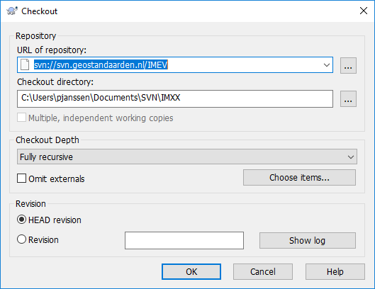
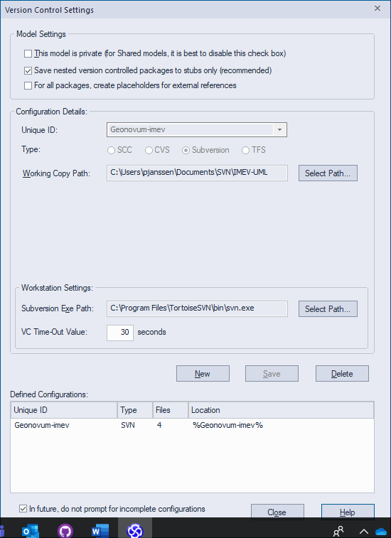

Handleiding voor het installeren van SVN (Subversion) voor een EAP bestand.
===========================================================================

In ontwikkeling, kan fouten bevatten, graag aanvulling.

Inleiding
---------

De UML bestanden voor informatiemodellen staan idealiter onder subversion. Het
voordeel daarvan is: versiebeheer, gemeenschappelijk kunnen werken aan één UML
bestand (met uit- en incheck functie).

Stap 0: Installeer SVN Tortoise op pc.

Als je SVN Tortoise nog niet hebt, installeer deze van
<https://tortoisesvn.net/>

Stap 1: Folder op svn.geostandaarden.nl

Maak of laat maken, op svn.geostandaarden.nl een folder met de naam van het
model. Een voor de hand liggende naam van de folder: imxx

Stap 2: SVN folder op je werk pc/laptop

Maak in een lokale map op je werk-pc een folder aan waar de SVN bestanden naar toe worden
geschreven. svn.geostandaarden.nl/imxx synchroniseert met deze folder. Een naam
voor deze folder is bijvoorbeeld ‘svn’ met als subfolder imxx. De folder waarmee
gesynchroniseerd gaat worden is dan dus ‘svn/imxx’

Stap 3: svn/imxx folder relateren aan svn.geostandaaren.nl

Klik met rechtermuis op de leegte in de lokale net-aangemaakte svn/imxx folder. Select ‘SVN checkout…. ‘. Kopieer
de URL van de online svn folder (svn//svn.geostandaarden.nl/imxx) en checkout directory. De checkout directory is de folder gemaakt
in stap 2.

Stap 4: Breng EAP bestand(packages) onder SVN.

Het EAP bestand wordt op het niveau van packages onder SVN gebracht.

4a) Zet het EAP bestand op een locale folder op je PC.

4b) Open het EAP bestand

4C) Instellen version control settings.

Kies het package dat onder SVN moet en klik met rechtermuisknop. Kies ‘Package
Control’ en ‘Version Control Settings’.

Vul in:

Unique ID: zelf gekozen unieke aanduiding voor de package onder version control.
Voorstel: naam van het package.

Working Copy Path: Selecteer de folder waar de lokale SVN gegevens worden
weggeschreven. Dit is de folder uit stap 2.

Klik op ‘save’ en ‘close’

4D)Package onder version control brengen

Rechtsklik op package. Kies ‘Package Control’ en ‘Add branch to version
control’.

De Version Control Configuration staat waarschijnlijk goed. Deselect ‘Export as
Model Branch’ (waarom?) en klik op OK.

4C) Klaar. Via de rechterklik kan nu het package worden uit gecheckt (Check out)
om aan te werken of in gecheckt (Check in) om terug te zetten.
